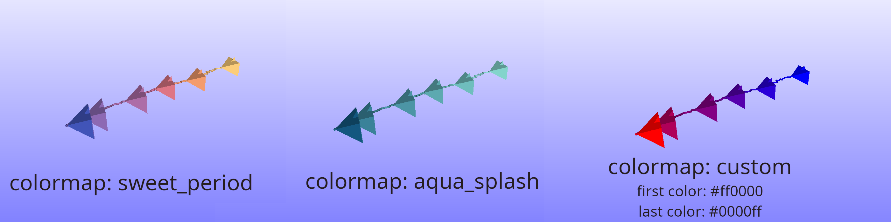
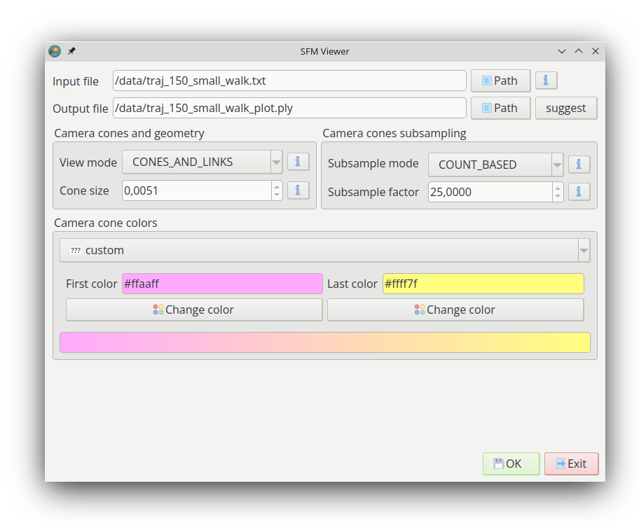

# py_sfm_viewer
**py_sfm_viewer** is an open source, lightweight and multi-platform library to view the camera trajectory offline.

<p align="center">

</p>

Some feature of the **py_sfm_viewer** library:

* **Offline use**: does not necessitate a running SLAM system to view the camera trajectory. It only uses the saved camera poses to show the path it took as showed in the figure above.

* **Command line and GUI**: the package can be used via command line, or can be run  with a user interface.

* **Gradiant colors**: the library uses a gradient between two (or more) colors in order to make it easy to distinguish between the start and the end of the trajectory.

* **Lightweight**: the python package can be wrapped in a single file, and can be run as a script from anywhere.

* **Small number of dependencies**: the library only depends on numpy (and optionally PySide6 for the user interface).

* **Cross-platform**: can be used on Linux and Windows.

* **Ease of use**: small self-contained code base, small number of parameters, permissive BSD-3 license.

* **Easy to integrate**: to use in other projects, just import `geometry_builder.py`.

If you use this library, please cite our paper as shown below:

```
@inproceedings{kabbour2018human,
  title={Human Ear Surface Reconstruction Through Morphable Model Deformation},
  author={Kabbour, Salah Eddine and Richard, Pierre-Yves},
  booktitle={2018 Digital Image Computing: Techniques and Applications (DICTA)},
  pages={1--5},
  year={2018},
  organization={IEEE}
}
```


In the following we present the documentation of the library:

- [How to use?](#how-to-use)
  - [I have Python installed](#i-have-python-installed)
  - [I want to use it without any installation](#i-want-to-use-it-without-any-installation)

- [Data format](#data-format)

- [Usage Parameters](#usage-parameters)

- [Camera orientation](#camera-orientation)

- [Meshlab](#meshlab)

- [License](#license)

- [Special thanks](#special-thanks)

# How to use?

There are two ways to run the application, one depends on having Python. 
And one allows running the application as standalone without any installation:

## I have Python installed

Before running the application, `numpy` needs to be installed first. Also, installing `PySide6` is highly recommended to run the user interface. Otherwise, the application can also be launched via command line.

```commandline
python3 -m pip install numpy
python3 -m pip install pyside6  # recommended
```
**Warning:** in older OS versions (like ubuntu 20.04LTS) the latest `PySide6` does not work. So an older version needs to be installed:

```commandline
python3 -m pip install pyside6==6.2.3
```

### Regular use

The application can be launched by running the following command line:

```commandline
python3 src/__main__.py --gui on
```

Moreover, here is an example of running the application via command line.

```commandline
python3 src/__main__.py --gui off --input data/traj_150_small_walk.txt --cone_size 0.005 -s 3 --factor 2.5 --colormap red_salvation
```

However, we advise using the next method to run the application.
  
### Run as a script

All the file dependencies can be wrapped in a single file (except `numpy` and `pyside6`). 
This includes the application theme, icons and font. 
To achieve this, python built-in Zipapp module is used. 
So, running the following command takes care of wrapping the application:

```commandline
python3 bundle/bundle_using_zipapp.py
```

Alternatively, the bundled application can be downloaded from this [link](https://github.com/salaheddinek/py_sfm_viewer/releases/latest).

## I want to use it without any installation

The application can also be launched without any prior installation.
To achieve this, follow these steps:

* Step 1: download the latest release for the OS you use, using the following link: [https://github.com/salaheddinek/py_sfm_viewer/releases/latest](https://github.com/salaheddinek/py_sfm_viewer/releases/latest).
* Step 2: decompress the downloaded file.
* Step 3: launch by running the script `start_sfm_viewer.bat` for Windows, or by running `start_sfm_viewer.sh` for Linux.

# Data format

The application reads the camera poses from a '.txt' file, that contains the trajectory in the TUM format:

Each line is in the form of `[timestamp tx ty tz qx qy qz qw]`. Where` [tx ty tz]` represents the position of the frame,
and `[qc qy qz qw]` represent its orientation in the form of a quaternion. more info can be found in the following link:

[https://cvg.cit.tum.de/data/datasets/rgbd-dataset/file_formats](https://cvg.cit.tum.de/data/datasets/rgbd-dataset/file_formats)

# Usage Parameters

Show the help of the application parameters can be done, by running the following command line:

```commandline
python3 py_sfm_viewer.pyz --help
```

Or by clicking on the info buttons in the user interface (buttons with the icon 'i').

The parameters allow the user to control the size of the plotted camera cones, its colors. 
How ofter the camera cones are plotted (subsampling).

The following image show different colormaps used to plot the same trajectory:

<p align="center">

</p>

The following image show the user interface (app version 2.2.3):

<p align="center">

</p>

# Camera orientation

Camera orientation by default is directed toward the z-axis. 
It is worth mentioning that the top of the camera is facing the opposite direction of the y-axis,
this choice has been made to accommodate the fact that most image analysis programs inverse the y-axis while indexing pixels in an image. 
In other words, the bottom left pixel on an image has a positive **y** coordinate.

The default orientation of the camera can be changed by applying the same rotation to all camera cones. 
To achieve this, use the command line argument `--rotation`,
or via the GUI by selecting **show advanced options**.

# Meshlab

Meshlab ([https://www.meshlab.net/](https://www.meshlab.net/)) is an open source system for processing and editing 3D triangular meshes.
It can read and render multiple 3D file formats include '.ply' used by our library. 

The following figure shows a simple way to view the camera trajectory alongside with the 3D surface data reconstructed from the same set of camera frames:

<p align="center">

</p>

# License

We use a permissive BSD-3-Clause License  which allows easy integration of our library in any project ever if it is closed source. 
However, we motivate other developers to contribute to this open source project.

# Special thanks

At the end we would like to give thanks to developers of the open source [**appdirs**](https://github.com/ActiveState/appdirs) project that has been used in **py_sfm_viewer**, it has a permissive license which integrates well with BSD-3.

Also, A C++ version of this library can be found in this [link](https://github.com/salaheddinek/slam_viewer).

